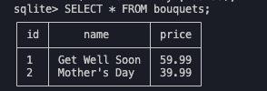
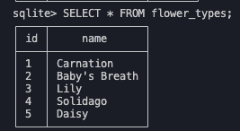

# Scenario

You want to create a database to record the bouquets created in your flower
shop. A bouquet has a name and a price, and it consists of one or more flowers.
Each flower has a color, a qualitative stem length (e.g., 'medium'), and an
association to a variety of flower (e.g., 'Rose').

The flower shop currently has two bouquets in stock with the following flowers:

* First bouquet is named 'Get Well Soon'. It has a price of $59.99 and the
  following flowers (color, stem length, variety):
  * 'yellow', 'short',  'Carnation'
  * 'white',  'short',  'Carnation'
  * 'white',  'short',  'Lily'
  * 'yellow', 'medium', 'Solidago'
  * 'yellow', 'short',  'Daisy'
* Second bouquet is named 'Mother''s Day'. It has a price of $39.99 and the
  following flowers (color, stem length, variety):
  * 'pink',             'long', 'Carnation'
  * 'purple',           'long', 'Carnation'
  * no color specified, 'long', 'Baby''s Breath'

## Mon HW

Formulate a database schema to best represent the given scenario and events.

Create the tables in __create-tables.js__. You can have **multiple**
SQL statements in this file.

HINT: Make sure to handle these items:

- ability to drop tables when they already exist
- price should be a decimal to 2 places

## TUE HW

*NOTE*, we will want to modify this later when we learn relationships

### Step 1
Using what we learned in class, we are now going to add data to the tables you should have created during the monday HW:

Insert the data for the given scenario and events in the insert-data.sql. This file will be run before every spec for the rest of this project. You can have multiple SQL statements in this file.

### Step 2
We need to find the bouquets in a price range. Here is a new scenario:

A customer on your website wants to find the names and prices of all the
bouquets priced between $30.45 and $40.36. The bouquets found should be ordered
alphabetically by name.

By the end of HW for Monday and HW for Tuesday you should be able to do these queries to get these results:

*NOTE*, we will insert flowers tomorrow when we learn about relationships

If you have everything set up correctly, then running a query on bouquets priced between $30.45 and $40.36 will output:
|              |       |
| ------------ | ----- |
| Mother's Day | 39.99 |

Running a query on bouquets priced greater than $50.00 will return:
|               |       |
| ------------- | ----- |
| Get Well Soon | 59.99 |

Lastly, running a query that will check bouquets between $30.00 and $60.00 will return:
|               |       |
| ------------- | ----- |
| Get Well Soon | 59.99 |
| Mother's Day  | 39.99 |

### Step 3

In the tue/delete-bouquet-by-name.sql file we need to delete the bouquet based on the following scenario:

The 'Get Well Soon' bouquet is not selling well, so you decide to remove it
from your inventory.

*NOTE* we will want to modify this later once we have flowers that also need to be deleted

When all is correct, if you run a query to get all bouqets

You should see:
|              |
| ------------ |
| Mother's Day |

### Step 4
In the /tue/find-all-bouquets file, add a query to get all bouqets where they are ordered alphabetically
